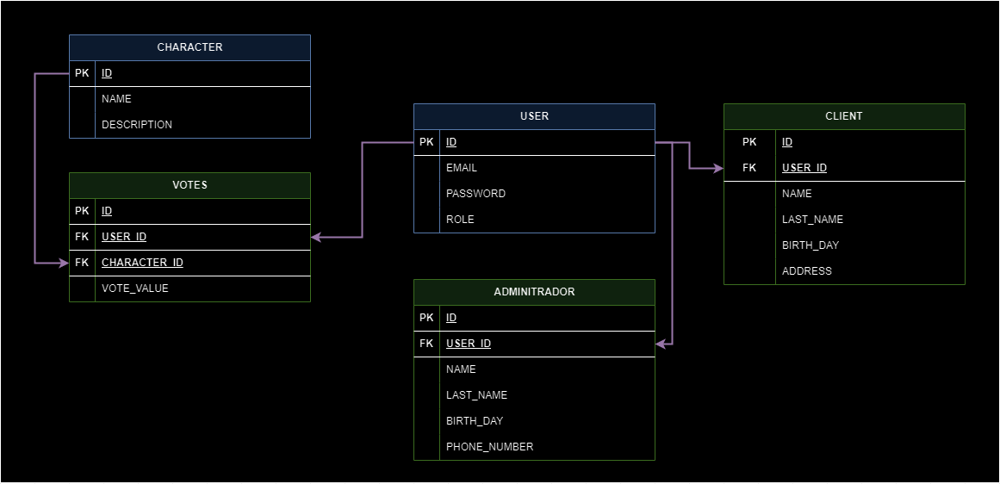

# Character Voting App with React, Node, Postgres, SocketIO

<a alt="Nx logo" href="https://nx.dev" target="_blank" rel="noreferrer"></a>

✨ **This workspace has been generated by [Nx, Smart Monorepos · Fast CI.](https://nx.dev)** ✨

## Description

This is a simple character voting app that allows users to vote for their favorite character. The app is built with React, Node, Postgres, and SocketIO.

## Features

- Users can vote for their favorite character
- Real-time updates with SocketIO
- Admin dashboard to view all information of the app (characters, votes, etc.)
- Admin can you add, edit, update and delete characters, votes, etc.
- Admin can view the votes in real-time
- Users can view the votes in real-time
- Users can only vote and see results
- Users must register before voting

## Installation

1. Clone the repository
2. Run `npm install` to install the dependencies
3. Run next command to start the app

- Execute client app
```bash
npm run dev:client
```
- Execute server app
```bash
npm run dev:server
```

## Technologies

- [Nx](https://nx.dev): for monorepo management
- [React](https://reactjs.org/): for the frontend
- [Node](https://nodejs.org/): for the backend
- [Postgres](https://www.postgresql.org/): for the database
- [SocketIO](https://socket.io/): for real-time updates
- [Drizzle](https://orm.drizzle.team): for the database ORM


### **Arquitectura General**

1. **Frontend**:
  - **React**: Para crear una interfaz de usuario interactiva.
  - **Context API / Redux**: Para manejar el estado global de la aplicación si es necesario.
  - **Socket.IO Client**: Para recibir actualizaciones en tiempo real sobre los votos.

2. **Backend**:
  - **Node.js**: Para el servidor y la lógica del backend.
  - **Express**: Framework para manejar rutas y middleware.
  - **Socket.IO Server**: Para manejar la comunicación en tiempo real.
  - **PostgreSQL**: Base de datos para almacenar los personajes y votos.
  - **Drizzle ORM**: Para mapear los modelos de datos a la base de datos.

### **Características de la Aplicación**

1. **Registro de Personajes**:
  - Permitir a los usuarios agregar nuevos personajes a la lista.
  - Validación de datos para evitar duplicados y asegurar la integridad de los datos.

2. **Votación en Tiempo Real**:
  - Los usuarios pueden votar por sus personajes favoritos.
  - Las votaciones deben reflejarse en tiempo real en todos los clientes conectados.

3. **Autenticación y Autorización**:
  - Opcional, para restringir ciertas acciones como agregar personajes o votar múltiples veces.

4. **Visualización de Resultados**:
  - Mostrar el conteo de votos en tiempo real.
  - Visualizaciones gráficas (barras, gráficos circulares) para representar los datos.

### **Flujo de Trabajo**

1. **Inicio y Configuración**:
  - Configurar el entorno de desarrollo con Node.js, React y MongoDB.
  - Inicializar un proyecto con `create-react-app` y configurar Express en el backend.

2. **Diseño del Esquema de la Base de Datos**:
  - **Personaje**:
    - `name`: String, nombre del personaje.
    - `description`: String, descripción del personaje.
    - `votes`: Number, conteo de votos.
  - **Voto** (opcional):
    - `characterId`: ObjectId, referencia al personaje votado.
    - `userId`: ObjectId, referencia al usuario que votó (si se implementa autenticación).

3. **Desarrollo del Backend**:
  - Configurar rutas para:
    - Obtener la lista de personajes.
    - Agregar un nuevo personaje.
    - Incrementar el conteo de votos para un personaje.
  - Integrar Socket.IO para enviar actualizaciones de votos en tiempo real.
  - Conectar a MongoDB usando Mongoose.

4. **Desarrollo del Frontend**:
  - Crear componentes para:
    - Listar personajes.
    - Formulario para agregar personajes.
    - Botones de votación.
    - Visualización de resultados de votación en tiempo real.
  - Configurar el cliente de Socket.IO para recibir actualizaciones.

5. **Integración del Sistema de Votación en Tiempo Real**:
  - Configurar el cliente y servidor de Socket.IO.
  - Enviar actualizaciones de votos desde el servidor a todos los clientes conectados.

6. **Despliegue y Escalabilidad**:
  - Preparar para el despliegue en servicios como Heroku, Vercel o AWS.
  - Configurar variables de entorno y conexiones seguras.
  - Escalar la aplicación para manejar múltiples usuarios y votaciones simultáneas.

## Disenio de la Base de Datos


